# neo-push

Example blog site built with `@neo4j/graphql` & React.js. This application showcases features of `@neo4j/graphql` such as;

1. Nested Mutations
2. @auth directive
3. OGM(Object Graph Mapper)

There are only two custom resolvers in the server; sign up plus sign in. The lack of custom logic is showcasing how quickly developers can build, both powerful and secure, applications ontop of Neo4j. Its worth nothing this entire application contains zero 'raw' cypher. All interaction's with the database are done through the generated GraphQL Schema via either the OGM or Apollo Server.

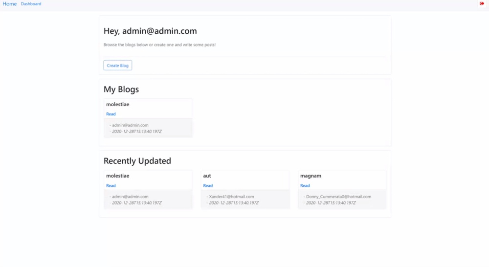
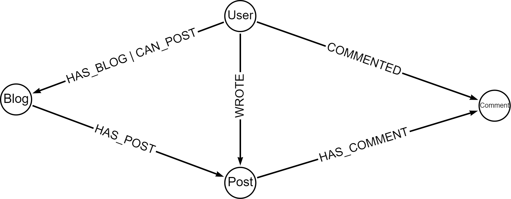
**Diagram from https://arrows.app/**

```graphql
type User {
    id: ID! @autogenerate
    email: String!
    password: String!
    createdBlogs: [Blog] @relationship(type: "HAS_BLOG", direction: "OUT")
    authorsBlogs: [Blog] @relationship(type: "CAN_POST", direction: "OUT")
    password: String! @private
    createdAt: DateTime @autogenerate(operations: ["create"])
    updatedAt: DateTime @autogenerate(operations: ["update"])
}

type Blog {
    id: ID! @autogenerate
    name: String!
    creator: User @relationship(type: "HAS_BLOG", direction: "IN")
    authors: [User] @relationship(type: "CAN_POST", direction: "IN")
    posts: [Post] @relationship(type: "HAS_POST", direction: "OUT")
    createdAt: DateTime @autogenerate(operations: ["create"])
    updatedAt: DateTime @autogenerate(operations: ["update"])
}

type Post {
    id: ID! @autogenerate
    title: String!
    content: String!
    blog: Blog @relationship(type: "HAS_POST", direction: "IN")
    comments: [Comment] @relationship(type: "HAS_COMMENT", direction: "OUT")
    author: User @relationship(type: "WROTE", direction: "IN")
    createdAt: DateTime @autogenerate(operations: ["create"])
    updatedAt: DateTime @autogenerate(operations: ["update"])
}

type Comment {
    id: ID! @autogenerate
    author: User @relationship(type: "COMMENTED", direction: "IN")
    content: String!
    post: Post @relationship(type: "HAS_COMMENT", direction: "IN")
    createdAt: DateTime @autogenerate(operations: ["create"])
    updatedAt: DateTime @autogenerate(operations: ["update"])
}
```

> Schema above simplified for clarity.

## Getting Started

If you want to run this Blog locally follow the steps below. When it comes to [Configure environment variables](#how-to-configure-environment-variables-?) you will need a [running Neo4j instance](#how-to-start-neo4j-?) to point to.

### How to configure environment variables ?

Each package contains a `./env.example` file. Copy this file, to the same directory, at `./.env` and adjust configuration to suit your local machine although the defaults may be fine.

### How to start Neo4j ?

There are many ways to get started with neo4j such as; [Neo4j Sandbox](https://neo4j.com/sandbox/), [Neo4j Desktop](https://neo4j.com/developer/neo4j-desktop/) or [Docker](https://neo4j.com/developer/docker/).

### Steps

Clone the repo;

```
$ git clone git@github.com:danstarns/neo-push.git
```

Enter the repo and install deps(lerna will install client and server);

```
$ cd neo-push && npm ci
```

=> [Configure environment variables](#how-to-configure-environment-variables-) <=

Run the client on;

```
$ npm run client:dev
```

Run Seeder on;

```
$ npm run seed
```

> Checkout the seeder its using the OGM

**Once seeded used the default credentials to log in**

1. Email: admin@admin.com
2. Password: password

Run the server on;

```
$ npm run server:dev
```

Navigate to http://localhost:4000 and sign up!

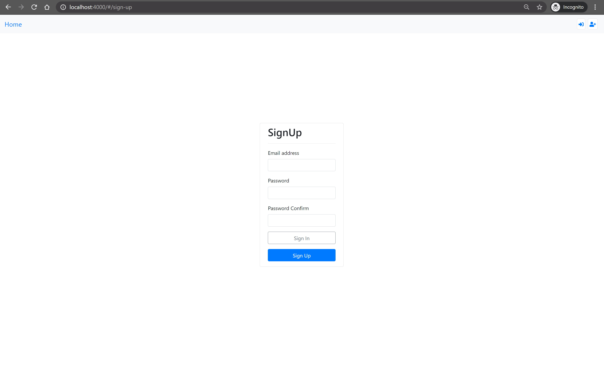

## Authentication

This application has two custom resolvers; sign in and sign up. In the resolvers we return a [JWT](https://jwt.io/). This JWT is stored in local storage on the client. The contents of the JWT is something like;

```
{
    "sub": "1234-4321-abcd-dcba", # user.id
    "iat": { ... }
}
```

the `.sub` property is the users id. We use `JWT_SECRET` env var on the sever to configure the secret, this happens to be the same env `@neo4j/graphql` looks at too.

> Note to keep things simple... This application has no JWT expiry or refreshing mechanism. Patterns you would implement outside of `@neo4j/graphql` so we deemed it less important in this showcase.

When the client is making a request to server we attach the JWT in the `authorization` header of the request, the same header `@neo4j/graphql` looks at.

## Users

At the core of the app but to keep things simple the UI doesn't have any profile page ect ect.

### Type Definitions

```graphql
type User {
    id: ID! @autogenerate
    email: String!
    password: String!
    createdBlogs: [Blog] @relationship(type: "HAS_BLOG", direction: "OUT")
    authorsBlogs: [Blog] @relationship(type: "CAN_POST", direction: "OUT")
    password: String! @private
    createdAt: DateTime @autogenerate(operations: ["create"])
    updatedAt: DateTime @autogenerate(operations: ["update"])
}

extend type User
    @auth(
        rules: [
            { operations: ["connect"], isAuthenticated: true }
            {
                operations: ["update"]
                allow: { id: "$jwt.sub" }
                bind: { id: "$jwt.sub" }
            }
            { operations: ["delete"], allow: { id: "$jwt.sub" } }
            {
                operations: ["disconnect"]
                allow: {
                    OR: [
                        { id: "$jwt.sub" }
                        {
                            createdBlogs: {
                                OR: [
                                    { creator: { id: "$jwt.sub" } }
                                    { authors: { id: "$jwt.sub" } }
                                ]
                            }
                        }
                        {
                            authorsBlogs: {
                                OR: [
                                    { creator: { id: "$jwt.sub" } }
                                    { authors: { id: "$jwt.sub" } }
                                ]
                            }
                        }
                    ]
                }
            }
        ]
    )
```

## Blogs

Before you can create a post you must create a blog. Users can have many blogs with many post. Each blog can have an array of authors, whom can post to the blog.

### Type Definitions

```graphql
type Blog {
    id: ID! @autogenerate
    name: String!
    creator: User @relationship(type: "HAS_BLOG", direction: "IN")
    authors: [User] @relationship(type: "CAN_POST", direction: "IN")
    posts: [Post] @relationship(type: "HAS_POST", direction: "OUT")
    isCreator: Boolean
        @cypher(
            statement: """
            OPTIONAL MATCH (this)<-[:HAS_BLOG]-(creator:User {id: $auth.jwt.sub})
            WITH creator IS NOT NULL AS isCreator
            RETURN isCreator
            """
        )
    isAuthor: Boolean
        @cypher(
            statement: """
            OPTIONAL MATCH (this)<-[:CAN_POST]-(author:User {id: $auth.jwt.sub})
            WITH author IS NOT NULL AS isAuthor
            RETURN isAuthor
            """
        )
    createdAt: DateTime @autogenerate(operations: ["create"])
    updatedAt: DateTime @autogenerate(operations: ["update"])
}

extend type Blog
    @auth(
        rules: [
            { operations: ["create"], bind: { creator: { id: "$jwt.sub" } } }
            {
                operations: ["update"]
                allow: { creator: { id: "$jwt.sub" } }
                bind: { creator: { id: "$jwt.sub" } }
            }
            {
                operations: ["connect"]
                allow: {
                    OR: [
                        { creator: { id: "$jwt.sub" } }
                        { authors: { id: "$jwt.sub" } }
                    ]
                }
            }
            {
                operations: ["disconnect"]
                allow: {
                    OR: [
                        { creator: { id: "$jwt.sub" } }
                        { authors: { id: "$jwt.sub" } }
                        { posts: { author: { id: "$jwt.sub" } } }
                    ]
                }
            }
            { operations: ["delete"], allow: { creator: { id: "$jwt.sub" } } }
        ]
    )
```

### @cypher

In the typeDefs above you will notice two `@cypher` directives being used; `isCreator` and `isAuthor` this custom cypher returns a boolean and makes the client side cleaner.

### Dashboard

Once logged in users are directed to the dashboard page;

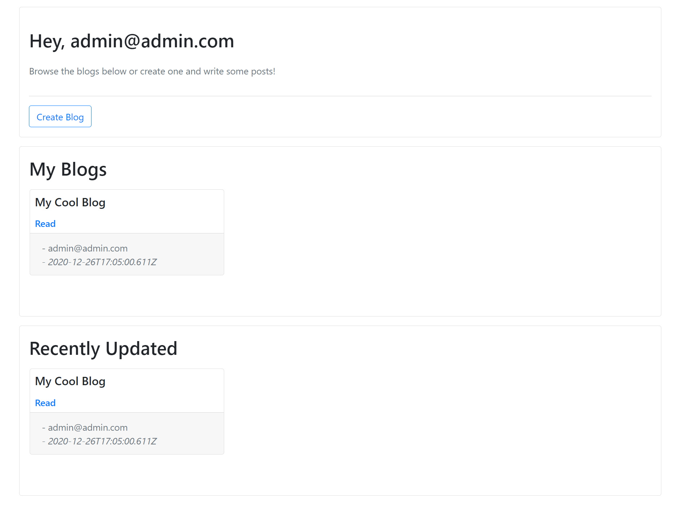

```graphql
query myBlogs($id: ID, $skip: Int, $limit: Int, $hasNextBlogsSkip: Int) {
    myBlogs: blogs(
        where: { OR: [{ creator: { id: $id } }, { authors: { id: $id } }] }
        options: { limit: $limit, skip: $skip, sort: createdAt_DESC }
    ) {
        id
        name
        creator {
            id
            email
        }
        createdAt
    }
    hasNextBlogs: blogs(
        where: { OR: [{ creator: { id: $id } }, { authors: { id: $id } }] }
        options: { limit: 1, skip: $hasNextBlogsSkip, sort: createdAt_DESC }
    ) {
        id
        createdAt
    }
}
```

### Pagination

⚠ Page info such as Relay spec is not supported in the current version of `@neo4j/graphql` so with the **My Blogs** and **Recently Updated Blogs** we query twice asking for the next item, to determine if there is a next page. Using this technique we can paginate the blog lists.

> Image showing pagination with limit of 1, in the app its default to 10.

> 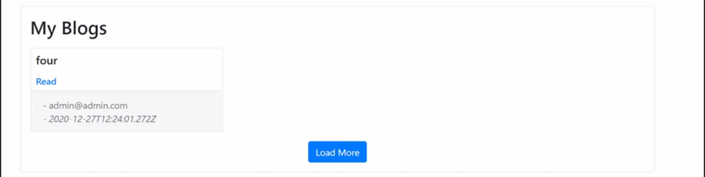

### Create Blog

From the dashboard you can create a blog.

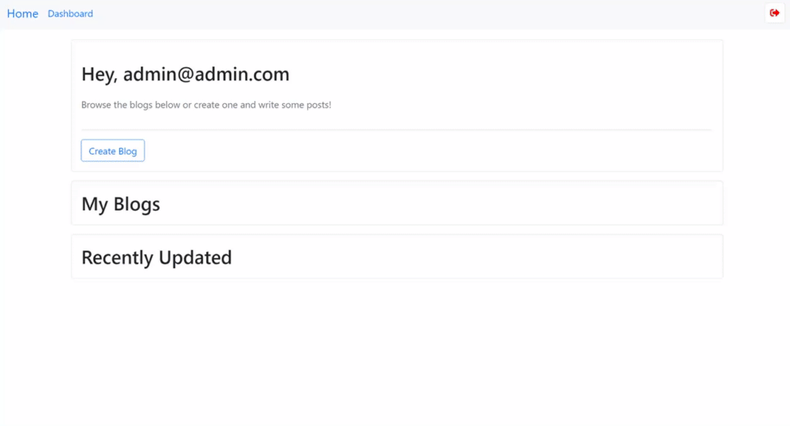

```graphql
mutation($name: String!, $sub: ID) {
    createBlogs(
        input: [{ name: $name, creator: { connect: { where: { id: $sub } } } }]
    ) {
        blogs {
            id
            name
            createdAt
        }
    }
}
```

### Edit Blog

If your the creator of a blog you can edit its name.


```graphql
mutation editBlog($id: ID, $name: String) {
    updateBlogs(where: { id: $id }, update: { name: $name }) {
        blogs {
            id
        }
    }
}
```

### Assign Author

If you are the creator of a blog you can assign other users as an author. You can also revoke too!

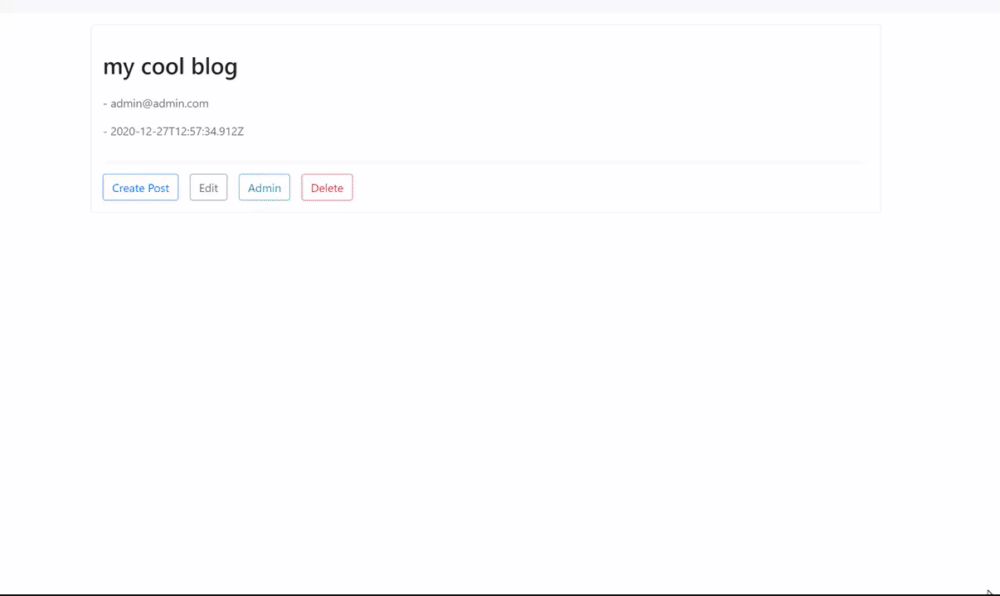

```graphql
mutation assignBlogAuthor($blog: ID, $authorEmail: String) {
    updateBlogs(
        where: { id: $blog }
        connect: { authors: { where: { email: $authorEmail } } }
    ) {
        blogs {
            authors {
                email
            }
        }
    }
}
```

```graphql
mutation revokeBlogAuthor($blog: ID, $authorEmail: String) {
    updateBlogs(
        where: { id: $blog }
        disconnect: { authors: { where: { email: $authorEmail } } }
    ) {
        blogs {
            authors {
                email
            }
        }
    }
}
```

### Delete Blog

If you are the creator of a blog you can delete it.

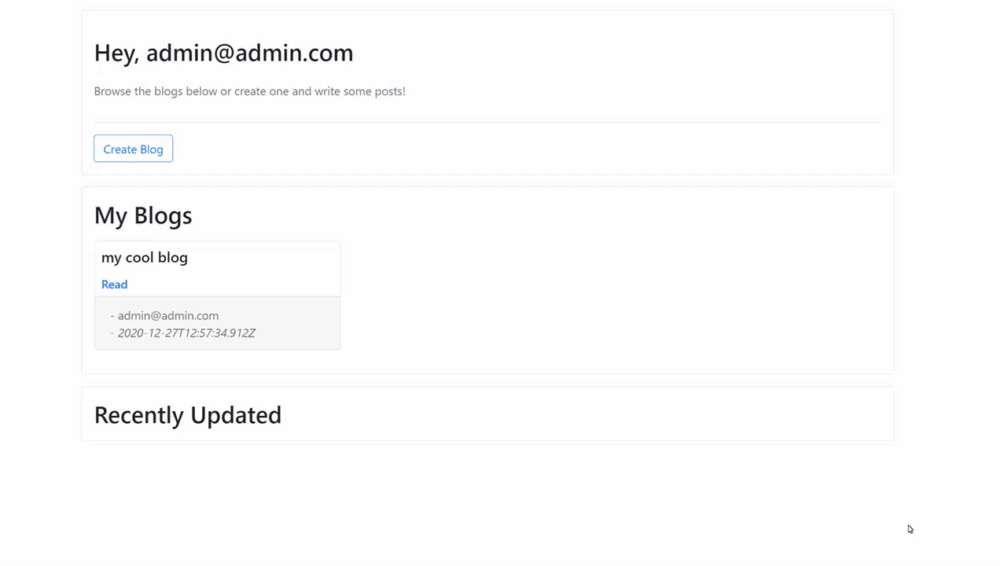

```graphql
mutation deleteBlog($id: ID) {
    deleteComments(where: { post: { blog: { id: $id } } }) {
        nodesDeleted
    }
    deletePosts(where: { blog: { id: $id } }) {
        nodesDeleted
    }
    deleteBlogs(where: { id: $id }) {
        nodesDeleted
    }
}
```

## Posts

Users can have many posts with many comments. Blog creators and authors can edit the post. Blog creators and authors of the post can delete it.

### Type Definitions

```graphql
type Post {
    id: ID! @autogenerate
    title: String!
    content: String!
    blog: Blog @relationship(type: "HAS_POST", direction: "IN")
    comments: [Comment] @relationship(type: "HAS_COMMENT", direction: "OUT")
    author: User @relationship(type: "WROTE", direction: "IN")
    canEdit: Boolean
        @cypher(
            statement: """
            OPTIONAL MATCH (this)<-[:WROTE]-(author:User {id: $auth.jwt.sub})
            OPTIONAL MATCH (this)<-[:HAS_POST]-(blog:Blog)
            OPTIONAL MATCH (blog)<-[:HAS_BLOG]-(blogCreator:User {id: $auth.jwt.sub})
            OPTIONAL MATCH (blog)<-[:CAN_POST]-(blogAuthors:User {id: $auth.jwt.sub})
            WITH (
                (author IS NOT NULL) OR
                (blogCreator IS NOT NULL) OR
                (blogAuthors IS NOT NULL)
            ) AS canEdit
            RETURN canEdit
            """
        )
    canDelete: Boolean
        @cypher(
            statement: """
            OPTIONAL MATCH (this)<-[:WROTE]-(author:User {id: $auth.jwt.sub})
            OPTIONAL MATCH (this)<-[:HAS_POST]-(blog:Blog)
            OPTIONAL MATCH (blog)<-[:HAS_BLOG]-(blogCreator:User {id: $auth.jwt.sub})
            WITH (
                (author IS NOT NULL) OR
                (blogCreator IS NOT NULL)
            ) AS canDelete
            RETURN canDelete
            """
        )
    createdAt: DateTime @autogenerate(operations: ["create"])
    updatedAt: DateTime @autogenerate(operations: ["update"])
}

extend type Post
    @auth(
        rules: [
            { operations: ["create"], bind: { author: { id: "$jwt.sub" } } }
            {
                operations: ["update"]
                allow: {
                    OR: [
                        { author: { id: "$jwt.sub" } }
                        {
                            blog: {
                                OR: [
                                    { creator: { id: "$jwt.sub" } }
                                    { authors: { id: "$jwt.sub" } }
                                ]
                            }
                        }
                    ]
                }
            }
            { operations: ["connect"], isAuthenticated: true }
            {
                operations: ["delete", "disconnect"]
                allow: {
                    OR: [
                        { author: { id: "$jwt.sub" } }
                        { blog: { creator: { id: "$jwt.sub" } } }
                    ]
                }
            }
        ]
    )
```

### Create Post

Once you have a blog. Either the creator or authors can create a post.

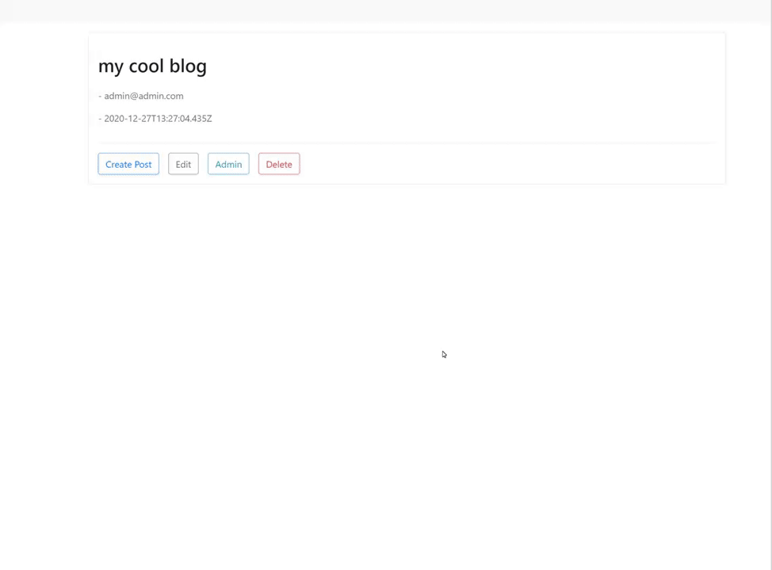

> Posts support markdown

```graphql
mutation createPost($title: String!, $content: String!, $user: ID, $blog: ID) {
    createPosts(
        input: [
            {
                title: $title
                content: $content
                blog: { connect: { where: { id: $blog } } }
                author: { connect: { where: { id: $user } } }
            }
        ]
    ) {
        posts {
            id
        }
    }
}
```

### Edit Post

Authors and creators can edit posts belonging to the blog.

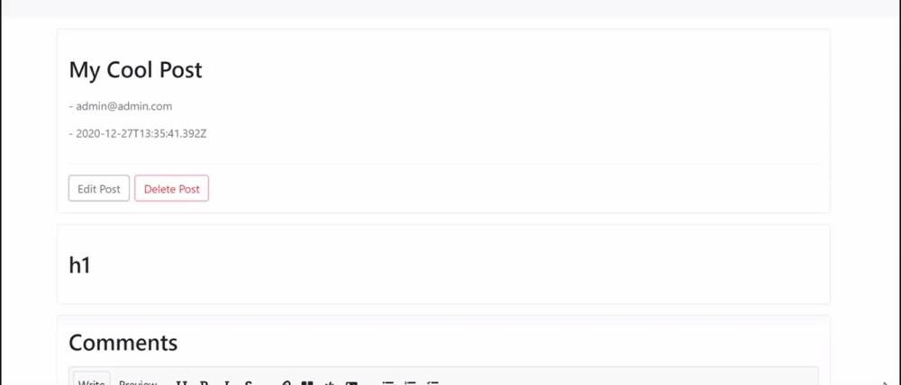

```graphql
mutation editPost($id: ID, $content: String, $title: String) {
    updatePosts(
        where: { id: $id }
        update: { content: $content, title: $title }
    ) {
        posts {
            id
        }
    }
}
```

### Delete Post

Creators of the blog and authors of the post can delete.

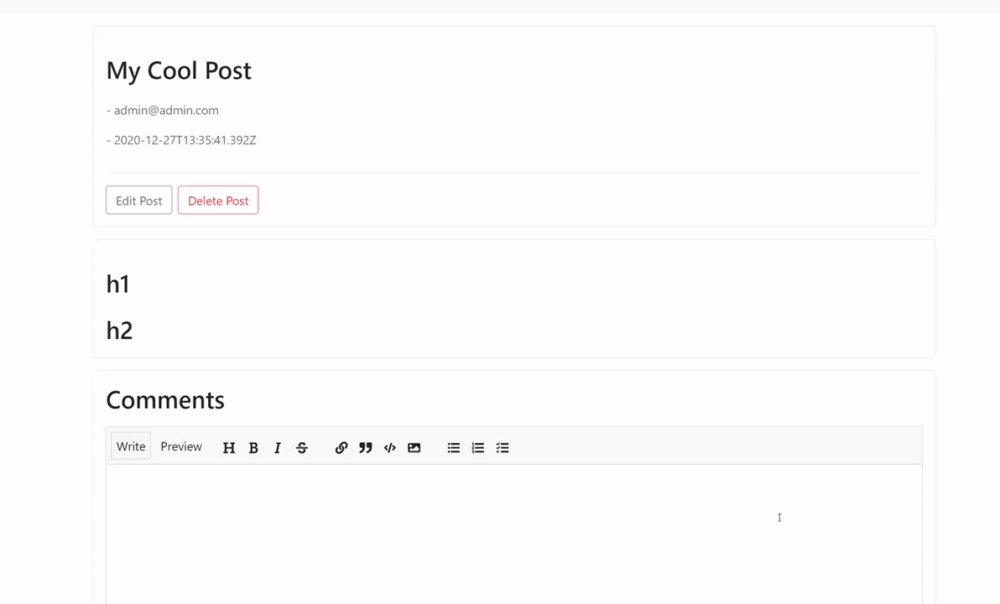

```graphql
mutation deletePost($id: ID) {
    deleteComments(where: { post: { id: $id } }) {
        nodesDeleted
    }
    deletePosts(where: { id: $id }) {
        nodesDeleted
    }
}
```

## Comments

Any user can comment on any post. The Author of the comment can edit. Blog creators and post authors can delete comments on a related post.

### Type Definitions

```graphql
type Comment {
    id: ID! @autogenerate
    author: User @relationship(type: "COMMENTED", direction: "IN")
    content: String!
    post: Post @relationship(type: "HAS_COMMENT", direction: "IN")
    canDelete: Boolean
        @cypher(
            statement: """
            OPTIONAL MATCH (this)<-[:COMMENTED]-(author:User {id: $auth.jwt.sub})
            OPTIONAL MATCH (this)<-[:HAS_COMMENT]-(post:Post)
            OPTIONAL MATCH (post)<-[:WROTE]-(postAuthor:User {id: $auth.jwt.sub})
            OPTIONAL MATCH (post)<-[:HAS_POST]-(blog:Blog)
            OPTIONAL MATCH (blog)<-[:HAS_BLOG]-(blogCreator:User {id: $auth.jwt.sub})
            WITH (
                (author IS NOT NULL) OR
                (postAuthor IS NOT NULL) OR
                (blogCreator IS NOT NULL)
            ) AS canDelete
            RETURN canDelete
            """
        )
    createdAt: DateTime @autogenerate(operations: ["create"])
    updatedAt: DateTime @autogenerate(operations: ["update"])
}

extend type Comment
    @auth(
        rules: [
            { operations: ["create"], bind: { author: { id: "$jwt.sub" } } }
            {
                operations: ["update", "connect"]
                allow: { author: { id: "$jwt.sub" } }
                bind: { author: { id: "$jwt.sub" } }
            }
            {
                operations: ["delete", "disconnect"]
                allow: {
                    OR: [
                        { author: { id: "$jwt.sub" } }
                        {
                            post: {
                                OR: [
                                    { author: { id: "$jwt.sub" } }
                                    { blog: { creator: { id: "$jwt.sub" } } }
                                ]
                            }
                        }
                    ]
                }
            }
        ]
    )
```

### Create Comment

Any user can comment on any post.

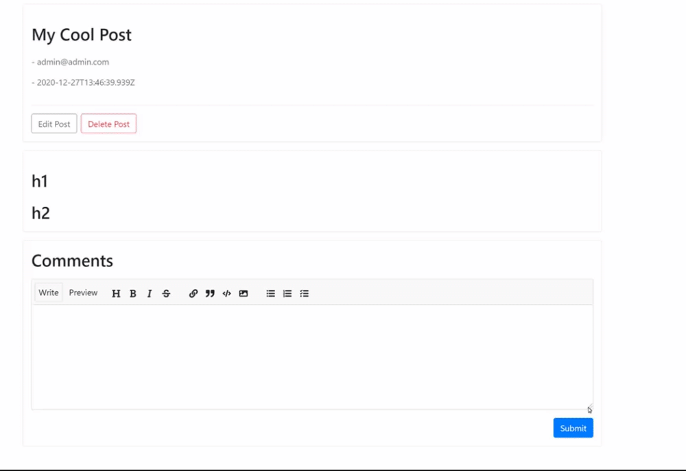

> Comments support markdown

```graphql
mutation commentOnPost($post: ID, $content: String!, $user: ID) {
    commentOnPost: createComments(
        input: [
            {
                content: $content
                post: { connect: { where: { id: $post } } }
                author: { connect: { where: { id: $user } } }
            }
        ]
    ) {
        comments {
            id
            content
            author {
                id
                email
            }
            createdAt
        }
    }
}
```

### Edit Comment

Users can edit there own comments.

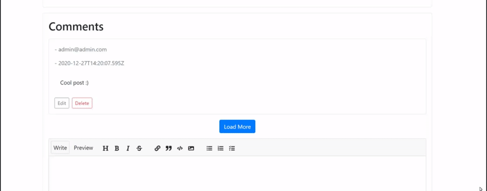

```graphql
mutation updateComment($id: ID, $content: String) {
    updateComments(where: { id: $id }, update: { content: $content }) {
        comments {
            id
        }
    }
}
```

### Delete Comment

Authors of the comment, authors of the post plus creators of the blog can delete a comment.

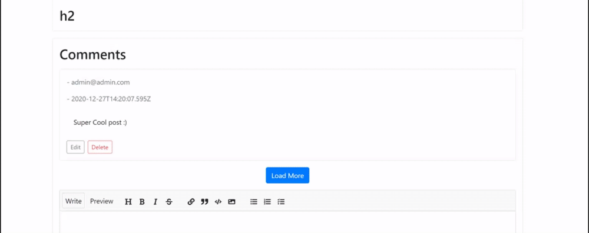

```graphql
mutation deleteComment($id: ID) {
    deleteComments(where: { id: $id }) {
        nodesDeleted
    }
}
```
