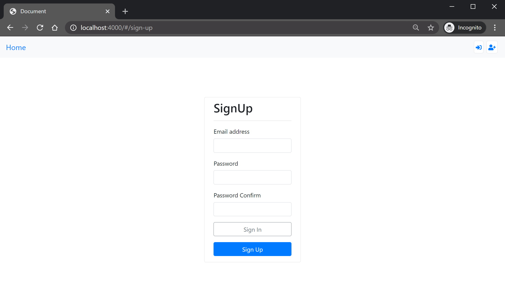

# neo-push

Example blog site built with `@neo4j/graphql` & React.js. This application showcases features of `@neo4j/graphql` such as;

1. Nested Mutations
2. @auth directive
3. OGM(Object Graph Mapper)

There are only two custom resolvers in the server; sign up plus sign in. The lack of custom logic is showcasing how quickly developers can build, both powerful and secure, applications ontop of Neo4j.

> Its worth nothing this entire application contains zero 'raw' cypher. All interaction's with the database are done through the generated GraphQL Schema via either the OGM or Apollo Server.


**Diagram from https://arrows.app/**

```graphql
type User {
    id: ID!
    email: String!
    createdBlogs: [Blog] @relationship(type: "HAS_BLOG", direction: "OUT")
    authorsBlogs: [Blog] @relationship(type: "CAN_POST", direction: "OUT")
}

type Blog {
    id: ID!
    name: String!
    creator: User @relationship(type: "HAS_BLOG", direction: "IN")
    authors: [User] @relationship(type: "CAN_POST", direction: "IN")
    posts: [Post] @relationship(type: "HAS_POST", direction: "OUT")
}

type Post {
    id: ID!
    title: String!
    blog: Blog @relationship(type: "HAS_POST", direction: "IN")
    comments: [Comment] @relationship(type: "HAS_COMMENT", direction: "IN")
    author: User @relationship(type: "WROTE", direction: "IN")
}

type Comment {
    id: ID!
    author: User @relationship(type: "COMMENTED", direction: "OUT")
    content: String!
    post: Post @relationship(type: "HAS_COMMENT", direction: "IN")
}
```

> Schema above simplified for clarity.

## Getting Started

If you want to run this Blog locally follow the steps below. When it comes to [Configure environment variables](#how-to-configure-environment-variables-?) you will need a [running Neo4j instance](#how-to-start-neo4j-?) to point to.

### How to configure environment variables ?

Each package contains a `./env.example` file. Copy this file, to the same directory, at `./.env` and adjust configuration to suit your local machine although the defaults may be fine.

### How to start Neo4j ?

There are many ways to get started with neo4j such as; [Neo4j Sandbox](https://neo4j.com/sandbox/), [Neo4j Desktop](https://neo4j.com/developer/neo4j-desktop/) or [Docker](https://neo4j.com/developer/docker/).

### Steps

Clone the repo;

```
$ git clone git@github.com:danstarns/neo-push.git
```

Enter the repo and install deps(lerna will install client and server);

```
$ cd neo-push && npm ci
```

=> [Configure environment variables](#how-to-configure-environment-variables) <=

Run the client on;

```
$ npm run client:dev
```

Run the server on;

```
$ npm run server:dev
```

Navigate to http://localhost:4000 and sign up!



## Authentication

This application has two custom resolvers; sign in and sign up. In the resolvers we return a [JWT](https://jwt.io/). This JWT is stored in local storage on the client. The contents of the JWT is something like;

```
{
    "sub": "1234-4321-abcd-dcba", # user.id
    "iat": { ... }
}
```

the `.sub` property is the users id. We use `JWT_SECRET` env var on the sever to configure the secret, this happens to be the same env `@neo4j/graphql` looks at too.

> Note to keep things simple... This application has no JWT expiry or refreshing mechanism. Patterns you would implement outside of `@neo4j/graphql` so we deemed it less important in this showcase.

When the client is making a request to server we attach the JWT in the `authorization` header of the request, the same header `@neo4j/graphql` looks at.

Thats all we need for authentication & more on authorization in the following sections.

## Users

At the core of the app you cant anything without a user. To keep things simple the UI doesn't have any profile page ect ect.

### typeDefs

```graphql
type User @timestamps {
    id: ID! @autogenerated
    email: String!
    password: String!
    createdBlogs: [Blog] @relationship(type: "HAS_BLOG", direction: "OUT")
    authorsBlogs: [Blog] @relationship(type: "CAN_POST", direction: "OUT")
}

extend type User
    @auth(
        rules: [
            { operations: ["read"], allow: "*" }
            { operations: ["create"], allow: "*" }
            { operations: ["connect"], isAuthenticated: true }
            {
                operations: ["update"]
                allow: { id: "sub" }
                bind: { id: "sub" }
            }
            { operations: ["delete"], allow: { id: "sub" } }
            {
                operations: ["disconnect"]
                allow: {
                    OR: [
                        { id: "sub" }
                        {
                            createdBlogs: {
                                OR: [
                                    { creator: { id: "sub" } }
                                    { authors: { id: "sub" } }
                                ]
                            }
                        }
                        {
                            authorsBlogs: {
                                OR: [
                                    { creator: { id: "sub" } }
                                    { authors: { id: "sub" } }
                                ]
                            }
                        }
                    ]
                }
            }
        ]
    )
```

### Authorization

In the typeDefs above you'll notice the `@auth` directive. Here we explain each rule in more detail.

#### read

```
{ operations: ["read"], allow: "*" }
```

Here is stating that all users even unauthenticated can read a user for example showing the author of a post.

#### create

```
{ operations: ["create"], allow: "*" }
```

Here is stating that all users even unauthenticated can create a User for example signing up.

#### connect

```
{ operations: ["connect"], isAuthenticated: true }
```

Here is stating that all users can create connections to a User for example users assigning another as a author of a blog.

#### update

```
{
    operations: ["update"]
    allow: { id: "sub" }
    bind: { id: "sub" }
}
```

Here is using both the `allow` and `bind` features in a new way. Using `allow` we are stating that users can only match and update nodes where the `user.id` property is equal to the JWT`.sub` property meaning users can only update themselves. The `bind` usage here is stating once you edit the user make sure that the `user.id` value is bound to the JWT`.sub` property meaning users cannot change there id.

#### delete

```
{ operations: ["delete"], allow: { id: "sub" } }
```

Here only the user themselves can delete themselves.

#### disconnect

```
{
    operations: ["disconnect"]
    allow: {
        OR: [
            { id: "sub" }
            {
                createdBlogs: {
                    OR: [
                        { creator: { id: "sub" } }
                        { authors: { id: "sub" } }
                    ]
                }
            }
            {
                authorsBlogs: {
                    OR: [
                        { creator: { id: "sub" } }
                        { authors: { id: "sub" } }
                    ]
                }
            }
        ]
    }
}
```

Here we are using complex relationship filter to ensure that only; the user themselves, and any author or creator, in the related blogs, can disconnect from a user. This allows blog creators and authors to delete user comments on posts and lets the creator of a blog to revoke a users author rights.

## Blogs

### typeDefs

```graphql
type Blog @timestamps {
    id: ID! @autogenerated
    name: String!
    creator: User @relationship(type: "HAS_BLOG", direction: "IN")
    authors: [User] @relationship(type: "CAN_POST", direction: "IN")
    posts: [Post] @relationship(type: "HAS_POST", direction: "OUT")
    isCreator: Boolean
        @cypher(
            statement: """
            OPTIONAL MATCH (this)<-[:HAS_BLOG]-(creator:User {id: $jwt.sub})
            WITH creator IS NOT NULL AS isCreator
            RETURN isCreator
            """
        )
    isAuthor: Boolean
        @cypher(
            statement: """
            OPTIONAL MATCH (this)<-[:CAN_POST]-(author:User {id: $jwt.sub})
            WITH author IS NOT NULL AS isAuthor
            RETURN isAuthor
            """
        )
}

extend type Blog
    @auth(
        rules: [
            { operations: ["create"], bind: { creator: { id: "sub" } } }
            { operations: ["read"], allow: "*" }
            {
                operations: ["update"]
                allow: { creator: { id: "sub" } }
                bind: { creator: { id: "sub" } }
            }
            {
                operations: ["connect"]
                allow: {
                    OR: [{ creator: { id: "sub" } }, { authors: { id: "sub" } }]
                }
            }
            {
                operations: ["disconnect"]
                allow: {
                    OR: [
                        { creator: { id: "sub" } }
                        { authors: { id: "sub" } }
                        { posts: { author: { id: "sub" } } }
                    ]
                }
            }
            { operations: ["delete"], allow: { creator: { id: "sub" } } }
        ]
    )
```

### @cypher

In the typeDefs above you will notice two `@cypher` directives being used; `isCreator` and `isAuthor` this custom cypher returns a boolean and makes the client side cleaner.

### Authorization

TODO AUTH

### Dashboard

Once logged in users are directed to the dashboard page;


Lets take a closer look at some of the queries being preformed here;

#### My Blogs

```graphql
query myBlogs($id: ID, $skip: Int, $limit: Int) {
    myBlogs: Blogs(
        where: { OR: [{ creator: { id: $id } }, { authors: { id: $id } }] }
        options: { limit: $limit, skip: $skip, sort: createdAt_DESC }
    ) {
        id
        name
        creator {
            id
            email
        }
        createdAt
    }
}
```

#### Recently Updated

```graphql
query recentlyUpdatedBlogs($skip: Int, $limit: Int) {
    recentlyUpdatedBlogs: Blogs(
        options: { limit: $limit, skip: $skip, sort: updatedAt_DESC }
    ) {
        id
        name
        creator {
            id
            email
        }
        createdAt
        updatedAt
    }
}
```

## Posts

## Comments
